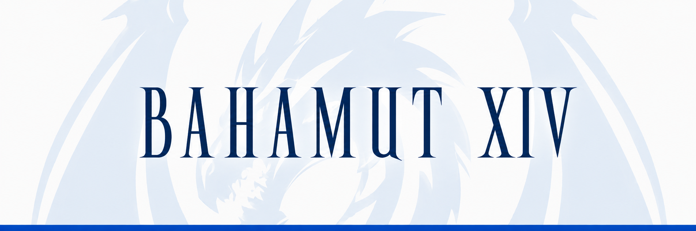

<h1 align="center">Bahamut Launcher</h1>

Launcher for the BahamutXIV Final Fantasy XIV 1.23b emulation server.

## Install

Download the latest version from the [releases page](https://github.com/BahamutXIV/bahamut-launcher/releases),
then follow [Getting started](docs/getting-started.md) for platform requirements,
installation, and first launch steps.

## System requirements

- Windows x86_64. The launcher installs missing WebView2 and x86 Visual C++
  runtimes when needed.
- Linux x86_64. SteamOS and Steam Deck use the [Flatpak package](docs/flatpak.md).
  The Linux archive requires glibc 2.35 or newer, WebKitGTK 4.1, and GTK 3. The
  launcher downloads its own Wine on the first game launch. The archive runs
  in place or installs with an application menu entry.
- macOS on Apple Silicon or Intel as a universal app, with managed Wine
  downloaded on first game launch. Apple Silicon needs Rosetta 2 for the
  Wine engine.

See [Getting started](docs/getting-started.md) for complete system requirements.

## Bug reports

Start with [Troubleshooting](docs/troubleshooting.md). For further assistance,
[join the Bahamut Discord](https://discord.gg/PxK5RJYQjm). Report reproducible
launcher bugs and focused feature requests in the [issue tracker](https://github.com/BahamutXIV/bahamut-launcher/issues).

## Documentation

Use the [documentation index](docs/README.md) for setup, configuration,
extension packages, and troubleshooting.

## Acknowledgement

- SeventhUmbral

## License

